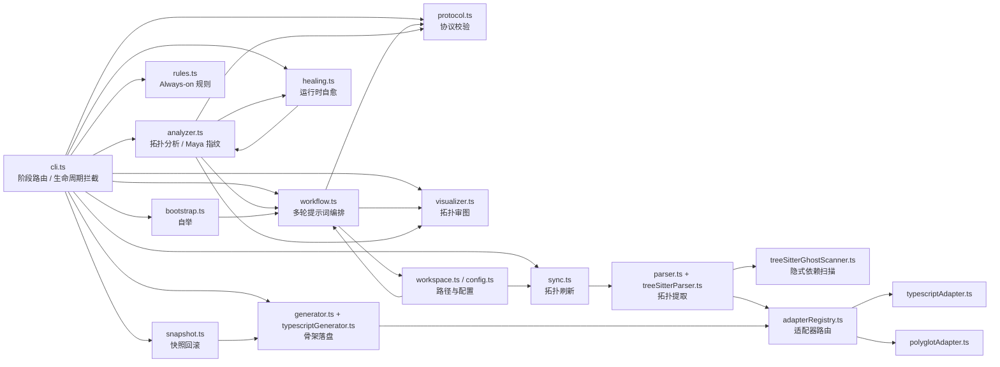
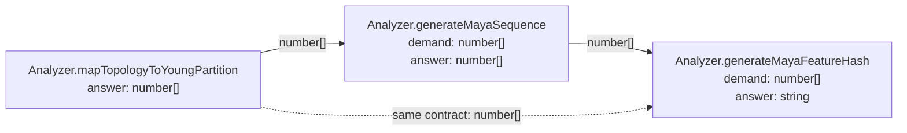

# TriadMind Core

TriadMind Core 是把“顶点三元法”落地为工程工具链的核心引擎。

它不鼓励模型直接写代码，而是强制先完成：

```text
需求
-> Macro-Split（挂载点 + 左右分支）
-> Meso-Split（子功能 / 类 / 数据管道）
-> Micro-Split（属性 / 状态 / 方法 / 契约）
-> draft-protocol.json
-> visualizer.html 审核
-> apply 骨架落盘
-> implementation-handoff.md 二阶段实现
```

## 核心理念

- 顶点：一个可用功能，是左右分支的逻辑包裹
- 左分支：动态演化，动作、方法、流程、子功能执行
- 右分支：静态稳定，属性、状态、配置、契约、编排
- 升级顺序：永远优先 `reuse -> modify -> create_child`

## 当前能力

- 严格协议校验：基于 `zod` 守卫 `draft-protocol.json`
- 多轮工作流：统一生成 `macro / meso / micro / protocol` 提示包
- 交互审图：生成 `.triadmind/visualizer.html` 审核拓扑升级
- 运行时自愈：错误日志 -> 节点映射 -> 修复协议提示
- 快照回滚：`snapshot / rollback` 保护 `apply`
- 多语言适配：`typescript / javascript / python / go / rust / cpp / java`
- 统一 AST 路径：默认走 Tree-sitter
- Ghost State Scanner：扫描 `this/self`、模块级变量、导入单例等隐式依赖
- 纯 JSON 拓扑分析：`blast radius`、`cycle`、`drift`、`renormalize`
- 架构语义指纹：`Triad Topology -> Young Partition -> Maya Sequence -> Maya-ID`

## 架构语义指纹：Sato Maya Diagram × Young Diagram

TriadMind 不再把结构指纹停留在普通二维邻接矩阵上，而是升级为：

```text
Triad Subgraph
-> Topological Normalization
-> Young Partition
-> Maya Sequence
-> SHA-256
-> Maya-ID
```

在 `analyzer.ts` 中，当前对应的核心函数是：

- `mapTopologyToYoungPartition`
- `generateMayaSequence`
- `generateMayaFeatureHash`

其中映射规则为：

- 先对三元子图做确定性规范化排序
- 再把强连通分量压缩成 DAG
- 用凝聚图深度决定杨图的“行”
- 用累计架构复杂度决定每一行宽度
- 沿杨图右下边界游走，`向右 = 0`，`向下 = 1`
- 最后得到一条黑白石子直线，也就是 `Maya Sequence`

兼容说明：

- 旧接口 `generateMayanMatrix` 仍保留，但仅作为兼容包装
- 新文档与新算法统一采用 `Maya / Young` 术语

## TriadMind 自举样例

当前仓库已经对 `triadmind-core` 自身完成一次拓扑刷新。

最新一次 `npm run sync` 的结果：

- 叶节点总数：`119`
- 模块总数：`27`
- 完整原始拓扑：`.triadmind/triad-map.json`
- 完整交互图：`.triadmind/visualizer.html`

### TriadMind 全局拓扑图（模块级）

下面这张图是 `triadmind-core` 自身的模块级拓扑视图；完整叶节点级拓扑请直接打开 `.triadmind/visualizer.html`。



### 单个功能片段样例：Maya 指纹链路

下面选取 `triadmind-core` 自身的一个真实功能片段：

- `Analyzer.mapTopologyToYoungPartition`
- `Analyzer.generateMayaSequence`
- `Analyzer.generateMayaFeatureHash`

对应的拓扑片段如下：



对应的三元片段 JSON 样例：

```json
[
  {
    "nodeId": "Analyzer.mapTopologyToYoungPartition",
    "fission": {
      "demand": ["any[] (subgraph)"],
      "answer": ["number[]"]
    }
  },
  {
    "nodeId": "Analyzer.generateMayaSequence",
    "fission": {
      "demand": ["number[] (partition)"],
      "answer": ["number[]"]
    }
  },
  {
    "nodeId": "Analyzer.generateMayaFeatureHash",
    "fission": {
      "demand": ["number[] (mayaSequence)"],
      "answer": ["string"]
    }
  }
]
```

这个真实片段经过 TriadMind 当前实现计算后，会得到：

```text
Young Partition: [15, 11, 4]
Maya Sequence : [0,0,0,0,1,0,0,0,0,0,0,1,0,0,0,1]
Maya Stones   : ⚪ ⚪ ⚪ ⚪ ⚫ ⚪ ⚪ ⚪ ⚪ ⚪ ⚪ ⚫ ⚪ ⚪ ⚪ ⚫
Maya-ID       : Maya-ID: 0xE76CFCD3
```

这意味着：

- `Young Partition` 是该拓扑片段的规范整数划分
- `Maya Sequence` 是边界游走后的 1/0 线性表示
- `Maya Stones` 是对玛雅黑白石子直线的直观展示
- `Maya-ID` 是最终稳定结构哈希

只要拓扑结构完全一致，即使 JSON 数组顺序不同，最后得到的 `Maya-ID` 也会完全相同。

## 最小工作流

在目标项目根目录执行：

```bash
npx triadmind init
npx triadmind invoke -d "@triadmind 在这里写你的需求"
npx triadmind invoke --apply
```

如果你在当前仓库本地开发，也可以直接使用：

```bash
npm run init
npm run invoke -- -d "@triadmind 在这里写你的需求"
npm run invoke -- --apply
```

## 静默调用

如果 AI 助手看到 `@triadmind` 就应该静默执行 TriadMind 工作流，统一使用：

```bash
npx triadmind invoke -d "@triadmind 在这里写你的需求"
```

这一步会自动：

- 刷新 `.triadmind/triad.md`
- 写入 `.triadmind/master-prompt.md`
- 更新 `.triadmind/latest-demand.txt`
- 生成 `macro / meso / micro / protocol` 任务文件

当 AI 已经将完整协议落到 `.triadmind/draft-protocol.json` 后，再执行：

```bash
npx triadmind invoke --apply
```

它会继续：

- 校验协议
- 生成 `.triadmind/visualizer.html`
- 执行 `apply`
- 刷新 `triad-map.json`
- 生成 `implementation-handoff.md`

## 安装

### 作为 CLI 安装

```bash
npm install -D triadmind-core
```

安装后可直接使用：

```bash
npx triadmind init
npx triadmind sync
npx triadmind rules
npx triadmind self
```

### 推荐脚本别名

在目标项目 `package.json` 中加入：

```json
{
  "scripts": {
    "triad:init": "triadmind init",
    "triad:invoke": "triadmind invoke",
    "triad:apply": "triadmind invoke --apply",
    "triad:sync": "triadmind sync",
    "triad:watch": "triadmind watch",
    "triad:rules": "triadmind rules",
    "triad:self": "triadmind self",
    "triad:heal": "triadmind heal"
  }
}
```

## 生成文件

TriadMind 会在目标项目下创建 `.triadmind/`：

- `triad.md`：顶点三元法规范
- `config.json`：语言 / 解析器 / 协议 / 自愈配置
- `triad-map.json`：当前项目拓扑图
- `draft-protocol.json`：待审核升级协议
- `visualizer.html`：可视化审图页面
- `master-prompt.md`：统一总提示词
- `protocol-task.md`：协议阶段任务说明
- `multi-pass-pipeline.md`：多轮推演说明
- `implementation-prompt.md`：实现前提示词
- `implementation-handoff.md`：骨架落盘后的实现提示词
- `healing-report.json`：运行时诊断报告
- `healing-prompt.md`：修复协议提示词
- `cache/sync-manifest.json`：增量同步缓存
- `snapshots/`：本地回滚快照

## 常用命令

在 `triadmind-core` 仓库中：

```bash
npm run init
npm run prompt
npm run pipeline
npm run macro
npm run meso
npm run micro
npm run protocol
npm run plan
npm run apply
npm run auto
npm run invoke
npm run sync
npm run watch
npm run rules
npm run self
npm run heal -- --message "TypeError: ..."
npm run snapshot -- "before-change"
npm run snapshots
npm run rollback -- "<snapshot-id>"
npm run adapters
npm run typecheck
```

## 协议硬约束

TriadMind 在 `plan / apply` 之前会拦截非法协议：

- `actions` 不能为空
- 仅允许 `reuse / modify / create_child`
- `reuse.nodeId` 必须已存在
- `modify.nodeId` 必须已存在
- `modify` 只能升级 `demand / answer`，不能篡改核心职责
- `create_child.parentNodeId` 必须已存在
- `create_child.node.nodeId` 必须是新节点
- 重复目标节点或重复动作会被拒绝
- 若启用置信度守卫，则低于阈值的动作会被拦截

## 跨语言方向

当前稳定支持：

- `typescript`
- `javascript`
- `python`
- `go`
- `rust`
- `cpp`
- `java`

统一链路为：

```text
Source Code
-> Tree-sitter AST
-> Triad Topology
-> Protocol
-> Language Adapter
-> Skeleton Code
```

关键边界：

- `languageAdapter.ts`：定义跨语言适配器契约
- `adapterRegistry.ts`：语言路由
- `typescriptAdapter.ts`：TypeScript 适配器
- `polyglotAdapter.ts`：JavaScript / Python / Go / Rust / C++ / Java 适配器
- `treeSitterParser.ts`：统一 AST 入口
- `treeSitterGhostScanner.ts`：统一 Ghost 核心
- `parser.ts / generator.ts`：纯调度器
- `analyzer.ts`：纯 JSON 拓扑分析，不依赖 AST 解析器

## CLI 生命周期守卫

- `plan`：先做 `blast radius` 预警
- `apply`：按项目语言分发到对应 `LanguageAdapter`
- `init / apply`：刷新拓扑后执行 `detectTopologicalDrift`
- `renormalize`：输出 `.triadmind/renormalize-protocol.json`
- `visualizer.html`：叠加显示宏节点、吸收边和重整化摘要

## 运行时自愈

运行时报错后：

```bash
npx triadmind heal --message "TypeError: Cannot read properties of undefined"
```

或先把错误写入 `.triadmind/runtime-error.log` 再执行：

```bash
npx triadmind heal
```

当前链路：

```text
Runtime Error
-> Trace-to-Node
-> left / right / contract / topology diagnosis
-> blast radius analysis
-> healing-prompt.md
-> LLM repair protocol
-> plan / apply
```

## Always-On Rules

执行：

```bash
npx triadmind rules
```

会自动生成：

- `.triadmind/agent-rules.md`
- `AGENTS.md`
- `.cursor/rules/triadmind.mdc`

这样 AI 助手会先读拓扑、配置和总提示词，再进入实现。

## Self Bootstrap

TriadMind Core 可以用自己的规则描述自己：

```bash
cd triadmind-core
npm run self
```

会生成：

- `.triadmind/self-bootstrap.md`
- `.triadmind/self-bootstrap-protocol.json`
- `.triadmind/draft-protocol.json`
- `.triadmind/visualizer.html`
- `AGENTS.md`
- `.cursor/rules/triadmind.mdc`

这表示 TriadMind 自身已经被纳入同一条：

```text
triad-map -> protocol -> visualizer -> apply -> rules
```

的自举闭环。

## 验证

推荐至少执行：

```bash
cd triadmind-core
npm install
npm run typecheck
npm run sync
npm run self
npm run rules
npm run heal -- --message "TypeError: Cannot read properties of undefined at runParser (...)"
```

## 进一步阅读

- 详细使用手册：`user guide.md`
- 当前仓库完整拓扑：`.triadmind/triad-map.json`
- 当前仓库完整可视化：`.triadmind/visualizer.html`
