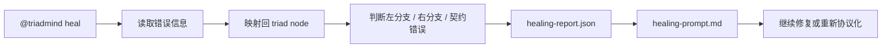

# TriadMind 用户手册

## 1. 这份手册是给谁看的

这份手册不是给 CLI 使用者看的。

这份手册是给在 AI 助手里使用 `@triadmind` 的用户看的。

你应该把 TriadMind 理解成：

```text
一个通过 @triadmind 被 AI 助手静默调用的架构工作流
```

而不是：

```text
一个需要你手工敲很多命令行参数的工具
```

---

## 2. 正确使用方式

你主要只需要两类输入：

- 需求型输入
- 控制型输入

### 2.1 需求型输入

直接把你的需求发给 AI 助手：

```text
@triadmind 在前端新增一个导出按钮，能把当前状态保存为 CSV
```

这表示：

```text
请 TriadMind 先理解当前项目拓扑，
再做 Macro / Meso / Micro 拆分，
再生成协议，
再审核拓扑，
最后再落盘。
```

### 2.2 控制型输入

如果你不想一句话走完整流程，而是想控制阶段，就用命令型输入：

```text
@triadmind init
@triadmind macro
@triadmind meso
@triadmind micro
@triadmind finalize
@triadmind plan
@triadmind apply
@triadmind renormalize
@triadmind heal
@triadmind handoff
```

---

## 3. 命令总览

| 命令 | 作用 |
|---|---|
| `@triadmind init` | 初始化项目的 TriadMind 工作区 |
| `@triadmind 你的需求` | 静默启动完整协议工作流 |
| `@triadmind protocol` | 只推进到协议，不直接落盘 |
| `@triadmind macro` | 进行 Macro-Split |
| `@triadmind meso` | 进行 Meso-Split |
| `@triadmind micro` | 进行 Micro-Split |
| `@triadmind finalize` | 汇总三轮结果，封装协议前态 |
| `@triadmind plan` | 生成并审核拓扑图 |
| `@triadmind apply` | 正式执行协议并落盘 |
| `@triadmind sync` | 重新扫描代码并刷新拓扑图 |
| `@triadmind renormalize` | 对旧代码做重整化治理 |
| `@triadmind heal` | 对运行时错误做拓扑修复 |
| `@triadmind handoff` | 生成实现阶段交接文件 |

---

## 4. 每个命令到底是干什么的

这一节是重点。

每个命令都按这四个维度解释：

- 一句话作用
- 你什么时候用
- TriadMind 内部会做什么
- 最终会产出什么

---

## 4.1 `@triadmind init`

### 一句话作用

初始化当前项目的 TriadMind 环境。

### 你什么时候用

- 第一次把 TriadMind 接入某个项目
- 你怀疑 `.triadmind/` 丢失了
- 你想重新建立项目的基础拓扑工作区

### TriadMind 内部会做什么

- 创建 `.triadmind/`
- 生成 `triad.md`
- 扫描代码并生成 `triad-map.json`
- 生成 `master-prompt.md`
- 安装 Always-on 规则

### 最终会产出什么

- `.triadmind/triad-map.json`
- `.triadmind/triad.md`
- `.triadmind/master-prompt.md`
- `AGENTS.md`
- `.cursor/rules/triadmind.mdc`

---

## 4.2 `@triadmind 你的需求`

### 一句话作用

让 TriadMind 静默处理一个新需求。

### 你什么时候用

- 你要新增功能
- 你要重构已有功能
- 你要做架构升级

### TriadMind 内部会做什么

- 读取当前 `triad-map.json`
- 寻找最合适的挂载点
- 先判断能否 `reuse`
- 再判断能否 `modify`
- 最后才允许 `create_child`
- 自动准备 Macro / Meso / Micro / Protocol 相关文件

### 最终会产出什么

- `latest-demand.txt`
- `implementation-prompt.md`
- `protocol-task.md`
- `macro-split.md`
- `meso-split.md`
- `micro-split.md`
- `draft-protocol.json`

### 典型例子

```text
@triadmind 在前端新增一个导出按钮，能把当前状态保存为 CSV
```

---

## 4.3 `@triadmind protocol`

### 一句话作用

只推进到协议阶段，不直接进入代码落盘。

### 你什么时候用

- 你只想先看架构方案
- 你只想让 AI 给出 `draft-protocol.json`
- 你想先审协议，不想立刻 apply

### TriadMind 内部会做什么

- 准备协议生成上下文
- 刷新当前需求和拓扑
- 把重点放在 `draft-protocol.json`

### 最终会产出什么

- `protocol-task.md`
- `draft-protocol.json`
- 相关 split 上下文文件

---

## 4.4 `@triadmind macro`

### 一句话作用

执行 Macro-Split，先找到挂载点并划分左右分支。

### 你什么时候用

- 你想强制 AI 先做宏观拆分
- 你想先看新功能挂在哪
- 你想先判断是修改旧节点还是新建子节点

### TriadMind 内部会做什么

- 基于 `triad-map.json` 找 Anchor
- 拆出：
  - 左分支 = 具体要干活的子功能
  - 右分支 = 编排、配置、状态、约束

### 最终会产出什么

- `macro-split.md`
- `macro-split.json`

---

## 4.5 `@triadmind meso`

### 一句话作用

执行 Meso-Split，把子功能继续拆成类和数据管道。

### 你什么时候用

- Macro 已经完成
- 你想把子功能变成明确的类边界
- 你想知道中观层的职责划分

### TriadMind 内部会做什么

- 把子功能拆成：
  - 类
  - 管道
  - 职责边界
  - 上下游关系

### 最终会产出什么

- `meso-split.md`
- `meso-split.json`

---

## 4.6 `@triadmind micro`

### 一句话作用

执行 Micro-Split，把类拆成属性、状态、方法、契约。

### 你什么时候用

- Meso 已经完成
- 你想得到最细粒度的实现前结构
- 你想明确 demand / answer

### TriadMind 内部会做什么

- 把类拆成：
  - 静态右分支：属性 / 状态 / 配置
  - 动态左分支：方法 / 动作 / 处理流程
  - demand / answer 类型签名

### 最终会产出什么

- `micro-split.md`
- `micro-split.json`

---

## 4.7 `@triadmind finalize`

### 一句话作用

把 Macro / Meso / Micro 三轮结果正式收口到协议阶段。

### 你什么时候用

- 你已经完成三轮拆分
- 你不想手工再搬运 JSON
- 你想让 TriadMind 自动同步 split 结果到 `draft-protocol.json`

### TriadMind 内部会做什么

- 回填 `macro / meso / micro` 到 `draft-protocol.json`
- 补齐 `userDemand / project / mapSource`
- 检查协议是否仍是空模板
- 如果协议完整，则校验它

### 最终会产出什么

- 更新后的 `draft-protocol.json`
- 若协议未完成，会刷新协议提示词

### 这条命令为什么重要

它解决的是以前最烦的问题：

```text
三轮拆分已经做完，
但 draft-protocol 还是空模板，
apply 直接失败。
```

现在用：

```text
@triadmind finalize
```

TriadMind 会自动帮你做“协议收口”。

---

## 4.8 `@triadmind plan`

### 一句话作用

进入拓扑审核阶段。

### 你什么时候用

- 你已经有 `draft-protocol.json`
- 你想先看拓扑图再决定是否落盘
- 你想确认叶节点新增、高亮连线、宏节点关系是否正确

### TriadMind 内部会做什么

- 校验协议合法性
- 生成 `visualizer.html`
- 把协议变化投影到可视化图中

### 最终会产出什么

- `.triadmind/visualizer.html`

### 这一命令的核心意义

```text
先看拓扑对不对，再决定要不要 apply
```

---

## 4.9 `@triadmind apply`

### 一句话作用

正式执行协议并落盘。

### 你什么时候用

- 你已经确认协议可以执行
- 你已经完成审核
- 你要真正修改项目结构或生成骨架

### TriadMind 内部会做什么

- 校验 `draft-protocol.json`
- 创建安全快照
- 选择语言适配器
- 执行协议
- 刷新 `triad-map.json`
- 生成 `implementation-handoff.md`

### 最终会产出什么

- 更新后的源码骨架
- 更新后的 `triad-map.json`
- `last-approved-protocol.json`
- `implementation-handoff.md`

---

## 4.10 `@triadmind sync`

### 一句话作用

重新扫描代码，刷新拓扑图。

### 你什么时候用

- 代码已经发生明显变化
- 你怀疑 `triad-map.json` 过期
- 你刚刚做了大量手工改动

### TriadMind 内部会做什么

- 扫描源码
- 增量或全量刷新拓扑
- 更新缓存

### 最终会产出什么

- 最新的 `triad-map.json`

---

## 4.11 `@triadmind renormalize`

### 一句话作用

对旧代码做重整化治理。

### 你什么时候用

- 项目里有历史包袱
- 存在循环依赖
- 多个节点互相缠绕，已经不适合继续直接 patch
- 你希望 TriadMind 先给出旧代码治理方案

### TriadMind 内部会做什么

- 检测强连通闭环
- 识别循环依赖簇
- 生成宏节点吸收方案
- 把旧结构整理成可治理工具包

### 最终会产出什么

- `renormalize-protocol.json`
- `renormalize-report.md`
- `renormalize-task.md`
- `renormalize-preview-protocol.json`
- `renormalize-visualizer.html`

### 这条命令和普通协议命令的区别

普通协议命令解决的是：

```text
怎么给项目增加一个新功能
```

而 `renormalize` 解决的是：

```text
怎么把已经混乱的旧代码结构重新整理成可治理状态
```

---

## 4.12 `@triadmind heal`

### 一句话作用

对运行时错误做拓扑修复。

### 你什么时候用

- 项目运行时报错
- 测试失败
- 你想让 TriadMind 判断错误属于哪个节点、哪个分支、哪种契约问题

### TriadMind 内部会做什么

- 读取错误信息
- 映射到拓扑节点
- 判断是左分支错误、右分支错误还是契约错误
- 生成修复协议或修复提示

### 最终会产出什么

- `healing-report.json`
- `healing-prompt.md`

### 示例

```text
@triadmind heal: TypeError: Cannot read properties of undefined ...
```

---

## 4.13 `@triadmind handoff`

### 一句话作用

进入实现交接阶段。

### 你什么时候用

- 协议已经 apply 完成
- 骨架已经落盘
- 你希望 AI 或开发者继续补完实现

### TriadMind 内部会做什么

- 收集最后批准的协议
- 收集最新拓扑图
- 收集已生成的骨架文件
- 生成下一阶段实现提示

### 最终会产出什么

- `implementation-handoff.md`

---

## 5. 推荐使用流

## 5.1 最推荐：一句话静默流

```text
@triadmind 在前端新增一个导出按钮，能把当前状态保存为 CSV
```

适合：

- 日常功能开发
- 增量功能升级
- 正常架构演进

---

## 5.2 半自动审核流

```text
@triadmind 在前端新增一个导出按钮，能把当前状态保存为 CSV
@triadmind finalize
@triadmind plan
@triadmind apply
```

适合：

- 你想先审协议
- 你想先看拓扑图
- 你不想 AI 一步到底直接落盘

---

## 5.3 严格三元拆分流

```text
@triadmind 需求：在前端新增一个导出按钮，能把当前状态保存为 CSV
@triadmind macro
@triadmind meso
@triadmind micro
@triadmind finalize
@triadmind plan
@triadmind apply
```

适合：

- 复杂架构改造
- 调试 TriadMind 的推演质量
- 强调严格三元拆分的项目

---

## 5.4 旧代码治理流

```text
@triadmind renormalize
```

适合：

- 历史代码治理
- 循环依赖拆解
- 旧模块重组

---

## 5.5 命令流程图

下面这三张图，对应最常见的三类使用方式。

### 新功能开发流


适合：

- 新功能开发
- 增量功能升级
- 正常架构演进

### 旧代码治理流


适合：

- 历史代码治理
- 循环依赖拆解
- 旧模块重组

### 运行时修复流



适合：

- 运行时报错
- 测试失败
- 契约失配或执行偏移

---

## 6. 你真正要记住的命令

如果你不想记太多，只记下面这些就够了：

```text
@triadmind init
@triadmind 你的需求
@triadmind finalize
@triadmind plan
@triadmind apply
@triadmind renormalize
@triadmind heal
```

---

## 7. 一句话总结

TriadMind 的用户手册本质上不应该是：

```text
CLI 命令手册
```

而应该是：

```text
AI 助手里的 @triadmind 指令说明书
```

---

## 8. TODO：递归重整化收敛链

当前 `@triadmind renormalize` 已经工具化，但要注意：它目前主要处理循环依赖、强连通分量、旧模块纠缠等问题，**还没有实现**“单节点下游连接大于等于 3 时，自动做左右分支重划分”。

这项能力暂时作为后续 TODO 预留，原因是它不是一次性的 patch，而是一条较长的治理链：

- 第 1 轮：处理最外层的高扇出过载节点
- 第 2 轮：刷新拓扑后继续向内层收敛
- 第 3 轮及以后：直到旧结构稳定为止
- 每一轮都要重新计算 `blast radius / cycles / drift`
- 每一轮都只处理当前层级的过载节点，避免一次性拆得过猛

所以你可以这样理解：

```text
当前 renormalize = 环折叠 / 旧结构治理
未来 renormalize --deep = 递归左右分支重整
```

建议未来预留命令：

```text
@triadmind renormalize --deep
```

或：

```text
@triadmind converge
```
