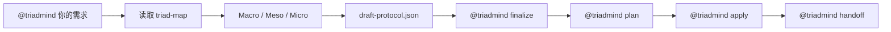
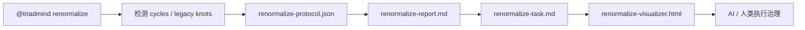
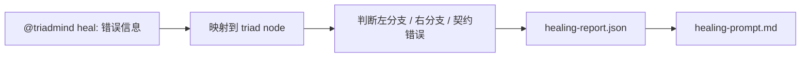

# TriadMind 用户手册

这份手册面向在 AI 助手里使用 `@triadmind` 的用户。你不需要记复杂的 `npx`、`npm` 或底层 CLI 参数；正常使用时，只需要在 AI 助手对话框里输入 `@triadmind ...`。

## 1. 核心理解

TriadMind 不是普通命令行工具，而是一个被 AI 助手静默调用的架构工作流：

```text
需求 -> 拓扑定位 -> Macro/Meso/Micro 拆分 -> 协议生成 -> 拓扑审核 -> 代码落盘
```

它的目标是让 AI 先理解项目拓扑，再修改代码，避免直接生成一次性面条代码。

## 2. 最常用方式

### 一句话静默开发

```text
@triadmind 在前端新增一个导出按钮，能把当前状态保存为 CSV
```

AI 助手会按 TriadMind 工作流自动完成：

- 读取当前 `triad-map.json`
- 寻找功能挂载点
- 拆分左分支动作与右分支状态
- 生成并校验 `draft-protocol.json`
- 审核拓扑影响
- 执行协议并落盘

### 半自动审核流

```text
@triadmind 在前端新增一个导出按钮，能把当前状态保存为 CSV
@triadmind finalize
@triadmind plan
@triadmind apply
```

适合你想先看协议和可视化图，再决定是否真正落盘。

## 3. 命令总览

| 命令 | 功能 |
|---|---|
| `@triadmind init` | 初始化当前项目的 `.triadmind/` 工作区，并默认生成 `triad-map.json` 与 `runtime-map.json` |
| `@triadmind 你的需求` | 静默启动完整功能开发工作流 |
| `@triadmind macro` | 做 Macro-Split，寻找挂载点并划分左右分支 |
| `@triadmind meso` | 做 Meso-Split，把子功能拆成类和数据管道 |
| `@triadmind micro` | 做 Micro-Split，把类拆成属性、方法、demand、answer |
| `@triadmind finalize` | 汇总三轮拆分，收口到 `draft-protocol.json` |
| `@triadmind protocol` | 只生成协议草案，不直接落盘 |
| `@triadmind plan` | 生成/刷新拓扑审核图 `visualizer.html` |
| `@triadmind apply` | 执行协议，生成或修改代码 |
| `@triadmind sync` | 重新扫描功能代码，默认同时刷新 `triad-map.json` 与 `runtime-map.json` |
| `@triadmind runtime` | 生成运行时拓扑 `runtime-map.json` / `runtime-diagnostics.json` |
| `@triadmind renormalize` | 对旧代码做环折叠和宏节点重整化治理 |
| `@triadmind renormalize --deep` | 预留递归重整化任务入口 |
| `@triadmind converge` | `renormalize --deep` 的静默别名 |
| `@triadmind heal` | 将运行时错误映射回拓扑节点并生成修复提示 |
| `@triadmind handoff` | 生成实现阶段交接文件 |

## 4. 典型工作流

### 新功能开发



### 旧代码治理



### 运行时修复



## 5. 扫描范围与强排除

TriadMind 现在不会默认把整个仓库都放进拓扑图。它会优先扫描前端 / 后端功能代码目录，避免数据库、测试、脚本、环境和第三方依赖污染 `triad-map.json`。

默认扫描配置：

```json
{
  "parser": {
    "scanCategories": ["frontend", "backend"],
    "scanMode": "capability",
    "ignoreGenericContracts": true
  },
  "visualizer": {
    "defaultView": "architecture",
    "showIsolatedCapabilities": false
  }
}
```

默认识别的功能目录包括：

- 前端：`src/frontend`、`frontend`、`src/client`、`client`、`src/web`、`web`、`src/app`、`app`
- 后端：`src/backend`、`backend`、`src/server`、`server`、`src/api`、`api`

如果你的项目目录名不同，请修改 `.triadmind/config.json` 的 `categories.frontend` 或 `categories.backend`。

### 不可关闭的强排除黑名单

无论是否回退到全项目源码扫描，以下目录或文件都会被强制排除：

- 数据库：`db`、`database`、`databases`、`prisma`、`migration`、`migrations`
- 测试：`test`、`tests`、`__tests__`、`spec`、`specs`
- 脚本：`script`、`scripts`
- 环境：`env`、`.env`、`.env.*`
- 第三方：`vendor`

这层黑名单是硬约束，目的是保证拓扑图只表达功能结构，而不是仓库杂项。

### Python capability mode

如果你在 Python 项目里觉得“每个方法都是一个节点”太碎，可以把 `.triadmind/config.json` 改成：

```json
{
  "parser": {
    "scanMode": "capability"
  }
}
```

启用后，TriadMind 会优先提升这些能力单元：

- `Node.execute` / `Service.run` / `Handler.handle` / `Workflow.step`
- API handler、tool action、pipeline stage
- `Service` / `Node` / `Workflow` / `Pipeline` 这类容器类的主入口

同时会主动压制噪声：

- `_helper`、`build_*`、`parse_*`、`validate_*`
- `get_*`、`set_*`、`serialize_*`
- `__str__`、`__repr__`、`__enter__`、`__exit__`

如果一个类只有一个主入口（例如 `execute`），TriadMind 会把同类辅助方法折叠成一个 `*_pipeline` 能力节点。

### JavaScript / TypeScript / Java / Go / Rust / C++ capability mode

JavaScript、TypeScript、Java、Go、Rust 和 C++ 项目都支持同样的能力视图：

```json
{
  "parser": {
    "scanMode": "capability"
  }
}
```

启用后，TriadMind 会优先提升这些单元：

- `Service.run`、`Handler.handle`、`Controller.process`
- `Node.execute`、`Workflow.step`、`Pipeline.run`
- 导出的 action / workflow / pipeline 入口
- 容器类里的主执行方法，如 `execute`、`run`、`handle`

同时会折叠这些噪声方法：

- `_build*`、`_parse*`、`validate*`、`get*`、`set*`
- `toString`、`toJSON`、`valueOf`
- 只承担拼接、格式化、缓存 key、路径构造的 helper

如果类里存在明显主入口，TriadMind 会把相关 helper 合并为 `ClassName.execute_pipeline` 之类的能力节点。

TypeScript 会保留显式业务类型，例如 `GeoTarget`、`GeoResult`；Java 会保留领域类类型，例如 `WorkflowExecution`、`Command`、`Result`；Go / Rust / C++ 会优先保留结构体、impl 类型、领域对象类型。`string`、`boolean`、`String`、`std::string`、`int`、`Vec` 这类通用类型默认只作为 `[Generic]` 信息展示，不参与拓扑连边。

### 通用类型降权

为避免 `str`、`dict`、`Any` 这类低语义类型把整张图误连起来，TriadMind 默认会忽略这些通用契约的连边，只保留更像业务载荷的类型，例如：

- `WorkflowExecution`
- `GeoReconCommand`
- `ExportCsvResult`
- `UserProfileDto`

## 6. 重要产物

| 文件 | 作用 |
|---|---|
| `.triadmind/triad-map.json` | 当前项目拓扑图 |
| `.triadmind/runtime-map.json` | 运行时拓扑图 |
| `.triadmind/runtime-diagnostics.json` | 运行时提取诊断 |
| `.triadmind/draft-protocol.json` | 待执行协议 |
| `.triadmind/last-approved-protocol.json` | 最近一次成功执行的协议 |
| `.triadmind/visualizer.html` | 顶点三元拓扑审核图 |
| `.triadmind/runtime-visualizer.html` | 运行时拓扑审核图 |
| `.triadmind/implementation-prompt.md` | 实现阶段提示 |
| `.triadmind/implementation-handoff.md` | 实现交接文件 |
| `.triadmind/renormalize-task.md` | 旧代码治理任务书 |
| `.triadmind/renormalize-visualizer.html` | 旧代码治理可视化图 |

## 7. 重整化 TODO

当前 `@triadmind renormalize` 已经工具化，主要处理：

- 循环依赖
- 强连通分量
- 旧模块纠缠
- 宏节点吸收方案

暂未自动执行“单节点下游连接大于等于 3 时的左右分支重划分”。这会作为未来递归治理链继续推进：

```text
@triadmind renormalize --deep
@triadmind converge
```

预期治理方式是从最外层逐层收敛到最里层，每一轮都重新计算 `blast radius / cycles / drift`，避免一次性拆得过猛。

## 8. 最小记忆版

日常只需要记住：

```text
@triadmind init
@triadmind 你的需求
@triadmind plan
@triadmind apply
@triadmind sync
@triadmind renormalize
```
---

## 9. 最新默认行为（RHEOS 实测后）

现在如果你不特别配置，TriadMind 会按下面的方式工作：

- 默认只优先扫描功能代码，不把整仓库都塞进拓扑图。
- 默认 `scanMode = capability`，优先把能力单元而不是碎方法提升成节点。
- 默认强排除：`node_modules`、`.next`、`venv`、`.venv`、`__pycache__`、`.pytest_cache`、`logs`、`uploads`、`fastgpt_data`、`db`、`tests`、`scripts`、`env`、`vendor`。
- 默认遇到 `EACCES` / `EPERM` / `ENOENT` 直接跳过，不再让 `@triadmind init` 或 `@triadmind sync` 因权限报错崩掉。
- 默认忽略低语义契约连边，例如 `str`、`string`、`int`、`bool`、`dict`、`any`、`Dict[str,Any]`、`Optional[str]`、`Optional[int]`、`Request`、`Response`、`Path`。
- 默认给可视化加性能护栏：大图时压缩旧节点分支、限制 contract edges、Maya 指纹自动走 fallback。

推荐把 `.triadmind/config.json` 保持为：

```json
{
  "parser": {
    "scanMode": "capability",
    "ignoreGenericContracts": true,
    "genericContractIgnoreList": [
      "str",
      "string",
      "int",
      "bool",
      "boolean",
      "dict",
      "any",
      "Dict[str,Any]",
      "Optional[str]"
    ]
  },
  "visualizer": {
    "defaultView": "architecture",
    "showIsolatedCapabilities": false,
    "maxPrimaryEdges": 1500,
    "fastFingerprintThreshold": 8,
    "maxContractEdges": 1200,
    "fastMayaThreshold": 10,
    "maxRenderNodes": 400
  }
}
```

### 什么时候改成别的模式？

- `leaf`：你要看最细的方法级叶节点时用。
- `capability`：默认推荐，日常开发最稳。
- `module`：真正的模块聚合视图，会把 capability 节点折叠成 `Module.*`。
- `domain`：真正的领域聚合视图，会把 capability 节点折叠成 `Domain.*`。

### architecture 默认视图

- 默认主图不是叶子图，而是 capability architecture view。
- 默认隐藏 `left_branch` / `right_branch`，避免主图退化成“三元节点展开图”。
- 默认隐藏非关键孤立 capability，只保留入口、adapter、协议变更节点和实际协作链。
- 如需看最细实现，再切回 `leaf` 视图或直接查看某个 capability 的内部叶子集合。

### 审核视图切换

- `@triadmind plan --view leaf`：直接以 leaf 视图打开审核图。
- `@triadmind plan --show-isolated`：在 architecture 视图中保留孤立 capability。
- `@triadmind plan --full-contract-edges`：关闭 contract edge 限流，适合深度排障。
- `@triadmind invoke --apply --view leaf`：静默落盘前先生成 leaf 视图审核图。
- `@triadmind runtime --visualize`：生成运行时 HTML 审核图。
- `@triadmind runtime --view workflow`：聚焦 workflow / worker / queue 协作。
- `@triadmind runtime --view resources`：聚焦 DB / Redis / ObjectStore / tool 依赖。
- `@triadmind runtime --include-frontend --include-infra`：启用前端 API 调用与基础设施提取。
- `visualizer.html` 页面左上角现在自带 `Architecture / Leaf` 按钮，可随时切换。

### problem 语义命名

- TriadMind 不再默认把 capability 写成 `execute xxx flow`。
- 现在会优先根据 owner、模块路径、方法意图和契约名生成更高语义的 `problem`。
- 如果确实提炼不出足够强的职责名，才会显式标成 `[low_semantic_name]`。

---

## 10. 能力节点标准

TriadMind 现在默认遵循这个判断原则：

- 能力节点代表“系统能做什么”
- 不是“代码里有什么函数/类型/字段”

优先提升为能力节点的对象：

- API endpoint / CLI command / RPC handler / message consumer
- service capability / workflow capability / domain capability
- adapter / gateway / tool / worker / operator / agent execution unit
- 主动作方法：`execute` / `run` / `handle` / `process` / `dispatch` / `apply` / `invoke` / `plan` / `schedule` / `orchestrate`

默认不提升的对象：

- DTO / Schema / Enum / TypeAlias
- getter / setter / builder / parser / formatter / sanitizer / validator
- `_helper` / `_internal` / `test_*`
- 单纯的路径拼接、cache key、样板生命周期方法

如果一个候选单元只是“实现碎片”，TriadMind 会尽量把它折叠进主能力节点，而不是单独画成拓扑顶点。

### `module` / `domain` 现在怎么聚合？

- `module`：按 `sourcePath` 的文件/模块边界聚合，隐藏模块内部 capability 细节，只保留对外契约。
- `domain`：按 `category + 目录上下文` 聚合，隐藏领域内部 capability 细节，只保留跨领域契约。
- 如果仓库非常扁平、目录层次很浅，`domain` 视图可能会故意收敛成很少几个节点。
## Parser Filtering v0.2 默认行为

现在默认主图是 capability / architecture 视图，不再把实现碎片直接抬成主节点。

- 默认隐藏：私有符号、魔术方法、helper 动词方法、schema/model/entity/dto/type 路径、tests、migrations
- 默认降噪：`str`、`int`、`dict`、`Any`、`Request`、`Response`、`Path` 等低语义契约边
- 默认保留：`execute`、`run`、`handle`、`process`、`dispatch`、`apply`、`invoke`、`plan`、`schedule`、`orchestrate`
- 默认折叠：挂在 capability 下的 helper / leaf 实现不会在 architecture 主图单独出点，但仍保留给 drill-down / leaf 视图
- 如需最细函数图，请显式让 AI 助手使用 `leaf` 视图
