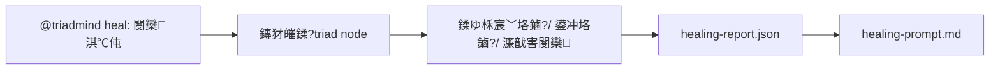

# TriadMind 鐢ㄦ埛鎵嬪唽

杩欎唤鎵嬪唽闈㈠悜鍦?AI 鍔╂墜閲屼娇鐢?`@triadmind` 鐨勭敤鎴枫€備綘涓嶉渶瑕佽澶嶆潅鐨?`npx`銆乣npm` 鎴栧簳灞?CLI 鍙傛暟锛涙甯镐娇鐢ㄦ椂锛屽彧闇€瑕佸湪 AI 鍔╂墜瀵硅瘽妗嗛噷杈撳叆 `@triadmind ...`銆?
## 1. 鏍稿績鐞嗚В

TriadMind 涓嶆槸鏅€氬懡浠よ宸ュ叿锛岃€屾槸涓€涓 AI 鍔╂墜闈欓粯璋冪敤鐨勬灦鏋勫伐浣滄祦锛?
```text
闇€姹?-> 鎷撴墤瀹氫綅 -> Macro/Meso/Micro 鎷嗗垎 -> 鍗忚鐢熸垚 -> 鎷撴墤瀹℃牳 -> 浠ｇ爜钀界洏
```

瀹冪殑鐩爣鏄 AI 鍏堢悊瑙ｉ」鐩嫇鎵戯紝鍐嶄慨鏀逛唬鐮侊紝閬垮厤鐩存帴鐢熸垚涓€娆℃€ч潰鏉′唬鐮併€?
## 2. 鏈€甯哥敤鏂瑰紡

### 涓€鍙ヨ瘽闈欓粯寮€鍙?
```text
@triadmind 鍦ㄥ墠绔柊澧炰竴涓鍑烘寜閽紝鑳芥妸褰撳墠鐘舵€佷繚瀛樹负 CSV
```

AI 鍔╂墜浼氭寜 TriadMind 宸ヤ綔娴佽嚜鍔ㄥ畬鎴愶細

- 璇诲彇褰撳墠 `triad-map.json`
- 瀵绘壘鍔熻兘鎸傝浇鐐?- 鎷嗗垎宸﹀垎鏀姩浣滀笌鍙冲垎鏀姸鎬?- 鐢熸垚骞舵牎楠?`draft-protocol.json`
- 瀹℃牳鎷撴墤褰卞搷
- 鎵ц鍗忚骞惰惤鐩?
### 鍗婅嚜鍔ㄥ鏍告祦

```text
@triadmind 鍦ㄥ墠绔柊澧炰竴涓鍑烘寜閽紝鑳芥妸褰撳墠鐘舵€佷繚瀛樹负 CSV
@triadmind finalize
@triadmind plan
@triadmind apply
```

閫傚悎浣犳兂鍏堢湅鍗忚鍜屽彲瑙嗗寲鍥撅紝鍐嶅喅瀹氭槸鍚︾湡姝ｈ惤鐩樸€?
## 3. 鍛戒护鎬昏

| 鍛戒护 | 鍔熻兘 |
|---|---|
| `@triadmind init` | 鍒濆鍖栧綋鍓嶉」鐩殑 `.triadmind/` 宸ヤ綔鍖猴紝骞堕粯璁ょ敓鎴?`triad-map.json` 涓?`runtime-map.json` |
| `@triadmind 浣犵殑闇€姹俙 | 闈欓粯鍚姩瀹屾暣鍔熻兘寮€鍙戝伐浣滄祦 |
| `@triadmind macro` | 鍋?Macro-Split锛屽鎵炬寕杞界偣骞跺垝鍒嗗乏鍙冲垎鏀?|
| `@triadmind meso` | 鍋?Meso-Split锛屾妸瀛愬姛鑳芥媶鎴愮被鍜屾暟鎹閬?|
| `@triadmind micro` | 鍋?Micro-Split锛屾妸绫绘媶鎴愬睘鎬с€佹柟娉曘€乨emand銆乤nswer |
| `@triadmind finalize` | 姹囨€讳笁杞媶鍒嗭紝鏀跺彛鍒?`draft-protocol.json` |
| `@triadmind protocol` | 鍙敓鎴愬崗璁崏妗堬紝涓嶇洿鎺ヨ惤鐩?|
| `@triadmind plan` | 鐢熸垚/鍒锋柊鎷撴墤瀹℃牳鍥?`visualizer.html` |
| `@triadmind apply` | 鎵ц鍗忚锛岀敓鎴愭垨淇敼浠ｇ爜 |
| `@triadmind sync` | 閲嶆柊鎵弿鍔熻兘浠ｇ爜锛岄粯璁ゅ悓鏃跺埛鏂?`triad-map.json` 涓?`runtime-map.json` |
| `@triadmind runtime` | 鐢熸垚杩愯鏃舵嫇鎵?`runtime-map.json` / `runtime-diagnostics.json` |
| `@triadmind renormalize` | 瀵规棫浠ｇ爜鍋氱幆鎶樺彔鍜屽畯鑺傜偣閲嶆暣鍖栨不鐞?|
| `@triadmind renormalize --deep` | 棰勭暀閫掑綊閲嶆暣鍖栦换鍔″叆鍙?|
| `@triadmind converge` | `renormalize --deep` 鐨勯潤榛樺埆鍚?|
| `@triadmind heal` | 灏嗚繍琛屾椂閿欒鏄犲皠鍥炴嫇鎵戣妭鐐瑰苟鐢熸垚淇鎻愮ず |
| `@triadmind handoff` | 鐢熸垚瀹炵幇闃舵浜ゆ帴鏂囦欢 |

## 4. 鍏稿瀷宸ヤ綔娴?
### 鏂板姛鑳藉紑鍙?
```mermaid
flowchart LR
    A["@triadmind 浣犵殑闇€姹?] --> B["璇诲彇 triad-map"]
    B --> C["Macro / Meso / Micro"]
    C --> D["draft-protocol.json"]
    D --> E["@triadmind finalize"]
    E --> F["@triadmind plan"]
    F --> G["@triadmind apply"]
    G --> H["@triadmind handoff"]
```

### 鏃т唬鐮佹不鐞?


### 杩愯鏃朵慨澶?


## 5. 鎵弿鑼冨洿涓庡己鎺掗櫎

TriadMind 鐜板湪涓嶄細榛樿鎶婃暣涓粨搴撻兘鏀捐繘鎷撴墤鍥俱€傚畠浼氫紭鍏堟壂鎻忓墠绔?/ 鍚庣鍔熻兘浠ｇ爜鐩綍锛岄伩鍏嶆暟鎹簱銆佹祴璇曘€佽剼鏈€佺幆澧冨拰绗笁鏂逛緷璧栨薄鏌?`triad-map.json`銆?
榛樿鎵弿閰嶇疆锛?
```json
{
  "parser": {
    "scanCategories": ["frontend", "backend"],
    "scanMode": "capability",
    "ignoreGenericContracts": true
  },
  "visualizer": {
    "defaultView": "architecture",
    "showIsolatedCapabilities": false
  }
}
```

榛樿璇嗗埆鐨勫姛鑳界洰褰曞寘鎷細

- 鍓嶇锛歚src/frontend`銆乣frontend`銆乣src/client`銆乣client`銆乣src/web`銆乣web`銆乣src/app`銆乣app`
- 鍚庣锛歚src/backend`銆乣backend`銆乣src/server`銆乣server`銆乣src/api`銆乣api`

濡傛灉浣犵殑椤圭洰鐩綍鍚嶄笉鍚岋紝璇蜂慨鏀?`.triadmind/config.json` 鐨?`categories.frontend` 鎴?`categories.backend`銆?
### 涓嶅彲鍏抽棴鐨勫己鎺掗櫎榛戝悕鍗?
鏃犺鏄惁鍥為€€鍒板叏椤圭洰婧愮爜鎵弿锛屼互涓嬬洰褰曟垨鏂囦欢閮戒細琚己鍒舵帓闄わ細

- 鏁版嵁搴擄細`db`銆乣database`銆乣databases`銆乣prisma`銆乣migration`銆乣migrations`
- 娴嬭瘯锛歚test`銆乣tests`銆乣__tests__`銆乣spec`銆乣specs`
- 鑴氭湰锛歚script`銆乣scripts`
- 鐜锛歚env`銆乣.env`銆乣.env.*`
- 绗笁鏂癸細`vendor`

杩欏眰榛戝悕鍗曟槸纭害鏉燂紝鐩殑鏄繚璇佹嫇鎵戝浘鍙〃杈惧姛鑳界粨鏋勶紝鑰屼笉鏄粨搴撴潅椤广€?
### Python capability mode

濡傛灉浣犲湪 Python 椤圭洰閲岃寰椻€滄瘡涓柟娉曢兘鏄竴涓妭鐐光€濆お纰庯紝鍙互鎶?`.triadmind/config.json` 鏀规垚锛?
```json
{
  "parser": {
    "scanMode": "capability"
  }
}
```

鍚敤鍚庯紝TriadMind 浼氫紭鍏堟彁鍗囪繖浜涜兘鍔涘崟鍏冿細

- `Node.execute` / `Service.run` / `Handler.handle` / `Workflow.step`
- API handler銆乼ool action銆乸ipeline stage
- `Service` / `Node` / `Workflow` / `Pipeline` 杩欑被瀹瑰櫒绫荤殑涓诲叆鍙?
鍚屾椂浼氫富鍔ㄥ帇鍒跺櫔澹帮細

- `_helper`銆乣build_*`銆乣parse_*`銆乣validate_*`
- `get_*`銆乣set_*`銆乣serialize_*`
- `__str__`銆乣__repr__`銆乣__enter__`銆乣__exit__`

濡傛灉涓€涓被鍙湁涓€涓富鍏ュ彛锛堜緥濡?`execute`锛夛紝TriadMind 浼氭妸鍚岀被杈呭姪鏂规硶鎶樺彔鎴愪竴涓?`*_pipeline` 鑳藉姏鑺傜偣銆?
### JavaScript / TypeScript / Java / Go / Rust / C++ capability mode

JavaScript銆乀ypeScript銆丣ava銆丟o銆丷ust 鍜?C++ 椤圭洰閮芥敮鎸佸悓鏍风殑鑳藉姏瑙嗗浘锛?
```json
{
  "parser": {
    "scanMode": "capability"
  }
}
```

鍚敤鍚庯紝TriadMind 浼氫紭鍏堟彁鍗囪繖浜涘崟鍏冿細

- `Service.run`銆乣Handler.handle`銆乣Controller.process`
- `Node.execute`銆乣Workflow.step`銆乣Pipeline.run`
- 瀵煎嚭鐨?action / workflow / pipeline 鍏ュ彛
- 瀹瑰櫒绫婚噷鐨勪富鎵ц鏂规硶锛屽 `execute`銆乣run`銆乣handle`

鍚屾椂浼氭姌鍙犺繖浜涘櫔澹版柟娉曪細

- `_build*`銆乣_parse*`銆乣validate*`銆乣get*`銆乣set*`
- `toString`銆乣toJSON`銆乣valueOf`
- 鍙壙鎷呮嫾鎺ャ€佹牸寮忓寲銆佺紦瀛?key銆佽矾寰勬瀯閫犵殑 helper

濡傛灉绫婚噷瀛樺湪鏄庢樉涓诲叆鍙ｏ紝TriadMind 浼氭妸鐩稿叧 helper 鍚堝苟涓?`ClassName.execute_pipeline` 涔嬬被鐨勮兘鍔涜妭鐐广€?
TypeScript 浼氫繚鐣欐樉寮忎笟鍔＄被鍨嬶紝渚嬪 `GeoTarget`銆乣GeoResult`锛汮ava 浼氫繚鐣欓鍩熺被绫诲瀷锛屼緥濡?`WorkflowExecution`銆乣Command`銆乣Result`锛汫o / Rust / C++ 浼氫紭鍏堜繚鐣欑粨鏋勪綋銆乮mpl 绫诲瀷銆侀鍩熷璞＄被鍨嬨€俙string`銆乣boolean`銆乣String`銆乣std::string`銆乣int`銆乣Vec` 杩欑被閫氱敤绫诲瀷榛樿鍙綔涓?`[Generic]` 淇℃伅灞曠ず锛屼笉鍙備笌鎷撴墤杩炶竟銆?
### 閫氱敤绫诲瀷闄嶆潈

涓洪伩鍏?`str`銆乣dict`銆乣Any` 杩欑被浣庤涔夌被鍨嬫妸鏁村紶鍥捐杩炶捣鏉ワ紝TriadMind 榛樿浼氬拷鐣ヨ繖浜涢€氱敤濂戠害鐨勮繛杈癸紝鍙繚鐣欐洿鍍忎笟鍔¤浇鑽风殑绫诲瀷锛屼緥濡傦細

- `WorkflowExecution`
- `GeoReconCommand`
- `ExportCsvResult`
- `UserProfileDto`

## 6. 閲嶈浜х墿

| 鏂囦欢 | 浣滅敤 |
|---|---|
| `.triadmind/triad-map.json` | 褰撳墠椤圭洰鎷撴墤鍥?|
| `.triadmind/runtime-map.json` | 杩愯鏃舵嫇鎵戝浘 |
| `.triadmind/runtime-diagnostics.json` | 杩愯鏃舵彁鍙栬瘖鏂?|
| `.triadmind/draft-protocol.json` | 寰呮墽琛屽崗璁?|
| `.triadmind/last-approved-protocol.json` | 鏈€杩戜竴娆℃垚鍔熸墽琛岀殑鍗忚 |
| `.triadmind/visualizer.html` | 椤剁偣涓夊厓鎷撴墤瀹℃牳鍥?|
| `.triadmind/runtime-visualizer.html` | 杩愯鏃舵嫇鎵戝鏍稿浘 |
| `.triadmind/implementation-prompt.md` | 瀹炵幇闃舵鎻愮ず |
| `.triadmind/implementation-handoff.md` | 瀹炵幇浜ゆ帴鏂囦欢 |
| `.triadmind/renormalize-task.md` | 鏃т唬鐮佹不鐞嗕换鍔′功 |
| `.triadmind/renormalize-visualizer.html` | 鏃т唬鐮佹不鐞嗗彲瑙嗗寲鍥?|

## 7. 閲嶆暣鍖?TODO

褰撳墠 `@triadmind renormalize` 宸茬粡宸ュ叿鍖栵紝涓昏澶勭悊锛?
- 寰幆渚濊禆
- 寮鸿繛閫氬垎閲?- 鏃фā鍧楃籂缂?- 瀹忚妭鐐瑰惛鏀舵柟妗?
鏆傛湭鑷姩鎵ц鈥滃崟鑺傜偣涓嬫父杩炴帴澶т簬绛変簬 3 鏃剁殑宸﹀彸鍒嗘敮閲嶅垝鍒嗏€濄€傝繖浼氫綔涓烘湭鏉ラ€掑綊娌荤悊閾剧户缁帹杩涳細

```text
@triadmind renormalize --deep
@triadmind converge
```

棰勬湡娌荤悊鏂瑰紡鏄粠鏈€澶栧眰閫愬眰鏀舵暃鍒版渶閲屽眰锛屾瘡涓€杞兘閲嶆柊璁＄畻 `blast radius / cycles / drift`锛岄伩鍏嶄竴娆℃€ф媶寰楄繃鐚涖€?
## 8. 鏈€灏忚蹇嗙増

鏃ュ父鍙渶瑕佽浣忥細

```text
@triadmind init
@triadmind 浣犵殑闇€姹?@triadmind plan
@triadmind apply
@triadmind sync
@triadmind renormalize
```
---

## 9. 鏈€鏂伴粯璁よ涓猴紙RHEOS 瀹炴祴鍚庯級

鐜板湪濡傛灉浣犱笉鐗瑰埆閰嶇疆锛孴riadMind 浼氭寜涓嬮潰鐨勬柟寮忓伐浣滐細

- 榛樿鍙紭鍏堟壂鎻忓姛鑳戒唬鐮侊紝涓嶆妸鏁翠粨搴撻兘濉炶繘鎷撴墤鍥俱€?- 榛樿 `scanMode = capability`锛屼紭鍏堟妸鑳藉姏鍗曞厓鑰屼笉鏄鏂规硶鎻愬崌鎴愯妭鐐广€?- 榛樿寮烘帓闄わ細`node_modules`銆乣.next`銆乣venv`銆乣.venv`銆乣__pycache__`銆乣.pytest_cache`銆乣logs`銆乣uploads`銆乣fastgpt_data`銆乣db`銆乣tests`銆乣scripts`銆乣env`銆乣vendor`銆?- 榛樿閬囧埌 `EACCES` / `EPERM` / `ENOENT` 鐩存帴璺宠繃锛屼笉鍐嶈 `@triadmind init` 鎴?`@triadmind sync` 鍥犳潈闄愭姤閿欏穿鎺夈€?- 榛樿蹇界暐浣庤涔夊绾﹁繛杈癸紝渚嬪 `str`銆乣string`銆乣int`銆乣bool`銆乣dict`銆乣any`銆乣Dict[str,Any]`銆乣Optional[str]`銆乣Optional[int]`銆乣Request`銆乣Response`銆乣Path`銆?- 榛樿缁欏彲瑙嗗寲鍔犳€ц兘鎶ゆ爮锛氬ぇ鍥炬椂鍘嬬缉鏃ц妭鐐瑰垎鏀€侀檺鍒?contract edges銆丮aya 鎸囩汗鑷姩璧?fallback銆?
鎺ㄨ崘鎶?`.triadmind/config.json` 淇濇寔涓猴細

```json
{
  "parser": {
    "scanMode": "capability",
    "ignoreGenericContracts": true,
    "genericContractIgnoreList": [
      "str",
      "string",
      "int",
      "bool",
      "boolean",
      "dict",
      "any",
      "Dict[str,Any]",
      "Optional[str]"
    ]
  },
  "visualizer": {
    "defaultView": "architecture",
    "showIsolatedCapabilities": false,
    "maxPrimaryEdges": 1500,
    "fastFingerprintThreshold": 8,
    "maxContractEdges": 1200,
    "fastMayaThreshold": 10,
    "maxRenderNodes": 400
  }
}
```

### 浠€涔堟椂鍊欐敼鎴愬埆鐨勬ā寮忥紵

- `leaf`锛氫綘瑕佺湅鏈€缁嗙殑鏂规硶绾у彾鑺傜偣鏃剁敤銆?- `capability`锛氶粯璁ゆ帹鑽愶紝鏃ュ父寮€鍙戞渶绋炽€?- `module`锛氱湡姝ｇ殑妯″潡鑱氬悎瑙嗗浘锛屼細鎶?capability 鑺傜偣鎶樺彔鎴?`Module.*`銆?- `domain`锛氱湡姝ｇ殑棰嗗煙鑱氬悎瑙嗗浘锛屼細鎶?capability 鑺傜偣鎶樺彔鎴?`Domain.*`銆?
### architecture 榛樿瑙嗗浘

- 榛樿涓诲浘涓嶆槸鍙跺瓙鍥撅紝鑰屾槸 capability architecture view銆?- 榛樿闅愯棌 `left_branch` / `right_branch`锛岄伩鍏嶄富鍥鹃€€鍖栨垚鈥滀笁鍏冭妭鐐瑰睍寮€鍥锯€濄€?- 榛樿闅愯棌闈炲叧閿绔?capability锛屽彧淇濈暀鍏ュ彛銆乤dapter銆佸崗璁彉鏇磋妭鐐瑰拰瀹為檯鍗忎綔閾俱€?- 濡傞渶鐪嬫渶缁嗗疄鐜帮紝鍐嶅垏鍥?`leaf` 瑙嗗浘鎴栫洿鎺ユ煡鐪嬫煇涓?capability 鐨勫唴閮ㄥ彾瀛愰泦鍚堛€?
### 瀹℃牳瑙嗗浘鍒囨崲

- `@triadmind plan --view leaf`锛氱洿鎺ヤ互 leaf 瑙嗗浘鎵撳紑瀹℃牳鍥俱€?- `@triadmind plan --show-isolated`锛氬湪 architecture 瑙嗗浘涓繚鐣欏绔?capability銆?- `@triadmind plan --full-contract-edges`锛氬叧闂?contract edge 闄愭祦锛岄€傚悎娣卞害鎺掗殰銆?- `@triadmind invoke --apply --view leaf`锛氶潤榛樿惤鐩樺墠鍏堢敓鎴?leaf 瑙嗗浘瀹℃牳鍥俱€?- `@triadmind runtime --visualize`锛氱敓鎴愯繍琛屾椂 HTML 瀹℃牳鍥俱€?- `@triadmind runtime --view workflow`锛氳仛鐒?workflow / worker / queue 鍗忎綔銆?- `@triadmind runtime --view resources`锛氳仛鐒?DB / Redis / ObjectStore / tool 渚濊禆銆?- `@triadmind runtime --include-frontend --include-infra`锛氬惎鐢ㄥ墠绔?API 璋冪敤涓庡熀纭€璁炬柦鎻愬彇銆?- `@triadmind runtime --visualize --layout dagre --trace-depth 2`锛氬惎鐢?Runtime Visualizer v2 浜や簰閾捐矾鍥鹃粯璁ゅ竷灞€銆?- `@triadmind runtime --visualize --layout leaf-force --hide-isolated`锛氬湪澶у浘涓紭鍏堟煡鐪嬪叧閿富閾捐矾銆?- `@triadmind runtime --visualize --theme leaf-like`锛氳繍琛屾椂鍥鹃粯璁よ创榻?`visualizer.html` 鐨?leaf 椋庢牸锛沗runtime-dark` 鐢ㄤ簬鏇村己瀵规瘮銆?- `@triadmind runtime --visualize --max-render-edges 500`锛氫粎鍦ㄦ樉寮忛厤缃椂鍚敤杈规埅鏂紱榛樿涓嶆埅鏂€?- `@triadmind sync` / `@triadmind init`锛歳untime 鎻愬彇榛樿璧?best-effort锛屾潈闄愮洰褰曞拰瓒呭ぇ鏂囦欢浼氬啓鍏?`runtime-diagnostics.json`锛屼笉浼氭嫋鍨富娴佺▼銆?- `@triadmind verify --json`锛氳緭鍑哄彲鏈鸿璐ㄩ噺鎸囨爣锛坉iagnostics / execute-like / ghost / unmatched-route / rendered-edge consistency锛夈€?- `@triadmind verify --strict`锛氬惎鐢ㄩ棬绂侀槇鍊煎苟鍦ㄥけ璐ユ椂杩斿洖闈?0 閫€鍑虹爜銆?- `@triadmind verify --strict --baseline .triadmind/verify-baseline.json`锛氬惎鐢?unmatched route 鍩虹嚎 +10% 瑙勫垯銆?- capability `visualizer.html`锛氶粯璁や娇鐢?fast fallback锛涘彧鏈夋樉寮?strict 妯″紡鎵嶄細璧伴噸鎸囩汗璺緞銆?- `visualizer.html` 椤甸潰宸︿笂瑙掔幇鍦ㄨ嚜甯?`Architecture / Leaf` 鎸夐挳锛屽彲闅忔椂鍒囨崲銆?
### problem 璇箟鍛藉悕

- TriadMind 涓嶅啀榛樿鎶?capability 鍐欐垚 `execute xxx flow`銆?- 鐜板湪浼氫紭鍏堟牴鎹?owner銆佹ā鍧楄矾寰勩€佹柟娉曟剰鍥惧拰濂戠害鍚嶇敓鎴愭洿楂樿涔夌殑 `problem`銆?- 濡傛灉纭疄鎻愮偧涓嶅嚭瓒冲寮虹殑鑱岃矗鍚嶏紝鎵嶄細鏄惧紡鏍囨垚 `[low_semantic_name]`銆?
---

## 10. 鑳藉姏鑺傜偣鏍囧噯

TriadMind 鐜板湪榛樿閬靛惊杩欎釜鍒ゆ柇鍘熷垯锛?
- 鑳藉姏鑺傜偣浠ｈ〃鈥滅郴缁熻兘鍋氫粈涔堚€?- 涓嶆槸鈥滀唬鐮侀噷鏈変粈涔堝嚱鏁?绫诲瀷/瀛楁鈥?
浼樺厛鎻愬崌涓鸿兘鍔涜妭鐐圭殑瀵硅薄锛?
- API endpoint / CLI command / RPC handler / message consumer
- service capability / workflow capability / domain capability
- adapter / gateway / tool / worker / operator / agent execution unit
- 涓诲姩浣滄柟娉曪細`execute` / `run` / `handle` / `process` / `dispatch` / `apply` / `invoke` / `plan` / `schedule` / `orchestrate`

榛樿涓嶆彁鍗囩殑瀵硅薄锛?
- DTO / Schema / Enum / TypeAlias
- getter / setter / builder / parser / formatter / sanitizer / validator
- `_helper` / `_internal` / `test_*`
- 鍗曠函鐨勮矾寰勬嫾鎺ャ€乧ache key銆佹牱鏉跨敓鍛藉懆鏈熸柟娉?
濡傛灉涓€涓€欓€夊崟鍏冨彧鏄€滃疄鐜扮鐗団€濓紝TriadMind 浼氬敖閲忔妸瀹冩姌鍙犺繘涓昏兘鍔涜妭鐐癸紝鑰屼笉鏄崟鐙敾鎴愭嫇鎵戦《鐐广€?
### `module` / `domain` 鐜板湪鎬庝箞鑱氬悎锛?
- `module`锛氭寜 `sourcePath` 鐨勬枃浠?妯″潡杈圭晫鑱氬悎锛岄殣钘忔ā鍧楀唴閮?capability 缁嗚妭锛屽彧淇濈暀瀵瑰濂戠害銆?- `domain`锛氭寜 `category + 鐩綍涓婁笅鏂嘸 鑱氬悎锛岄殣钘忛鍩熷唴閮?capability 缁嗚妭锛屽彧淇濈暀璺ㄩ鍩熷绾︺€?- 濡傛灉浠撳簱闈炲父鎵佸钩銆佺洰褰曞眰娆″緢娴咃紝`domain` 瑙嗗浘鍙兘浼氭晠鎰忔敹鏁涙垚寰堝皯鍑犱釜鑺傜偣銆?## Parser Filtering v0.2 榛樿琛屼负

鐜板湪榛樿涓诲浘鏄?capability / architecture 瑙嗗浘锛屼笉鍐嶆妸瀹炵幇纰庣墖鐩存帴鎶垚涓昏妭鐐广€?
- 榛樿闅愯棌锛氱鏈夌鍙枫€侀瓟鏈柟娉曘€乭elper 鍔ㄨ瘝鏂规硶銆乻chema/model/entity/dto/type 璺緞銆乼ests銆乵igrations
- 榛樿闄嶅櫔锛歚str`銆乣int`銆乣dict`銆乣Any`銆乣Request`銆乣Response`銆乣Path` 绛変綆璇箟濂戠害杈?- 榛樿淇濈暀锛歚execute`銆乣run`銆乣handle`銆乣process`銆乣dispatch`銆乣apply`銆乣invoke`銆乣plan`銆乣schedule`銆乣orchestrate`
- 榛樿鎶樺彔锛氭寕鍦?capability 涓嬬殑 helper / leaf 瀹炵幇涓嶄細鍦?architecture 涓诲浘鍗曠嫭鍑虹偣锛屼絾浠嶄繚鐣欑粰 drill-down / leaf 瑙嗗浘
- 濡傞渶鏈€缁嗗嚱鏁板浘锛岃鏄惧紡璁?AI 鍔╂墜浣跨敤 `leaf` 瑙嗗浘

---

## 11. Session Bootstrap (Cross-platform)

From this version, `triadmind init` runs bootstrap scaffolding by default (disable with `--skip-bootstrap`).

Generated files:

- `AGENTS.md` (managed block between `TRIADMIND_RULES_START/END`)
- `skills.md` (session SOP)
- `.triadmind/session-bootstrap.sh`
- `.triadmind/session-bootstrap.ps1`
- `.triadmind/session-bootstrap.cmd`

Commands:

```bash
triadmind bootstrap init
triadmind bootstrap init --force
triadmind bootstrap doctor --json
```

Cross-platform startup (run once per new terminal session):

```bash
# Linux/macOS
bash .triadmind/session-bootstrap.sh

# Windows PowerShell
.\.triadmind\session-bootstrap.ps1

# Windows CMD
.triadmind\session-bootstrap.cmd
```

Recommended CI order:

```bash
triadmind bootstrap doctor --json
triadmind govern ci --policy .triadmind/govern-policy.json --json
```
