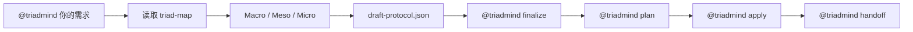
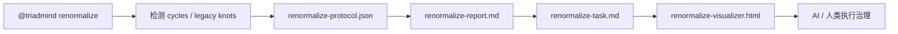
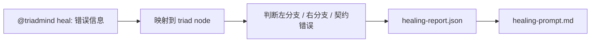

# TriadMind 用户手册

这份手册面向在 AI 助手里使用 `@triadmind` 的用户。你不需要记复杂的 `npx`、`npm` 或底层 CLI 参数；正常使用时，只需要在 AI 助手对话框里输入 `@triadmind ...`。

## 1. 核心理解

TriadMind 不是普通命令行工具，而是一个被 AI 助手静默调用的架构工作流：

```text
需求 -> 拓扑定位 -> Macro/Meso/Micro 拆分 -> 协议生成 -> 拓扑审核 -> 代码落盘
```

它的目标是让 AI 先理解项目拓扑，再修改代码，避免直接生成一次性面条代码。

## 2. 最常用方式

### 一句话静默开发

```text
@triadmind 在前端新增一个导出按钮，能把当前状态保存为 CSV
```

AI 助手会按 TriadMind 工作流自动完成：

- 读取当前 `triad-map.json`
- 寻找功能挂载点
- 拆分左分支动作与右分支状态
- 生成并校验 `draft-protocol.json`
- 审核拓扑影响
- 执行协议并落盘

### 半自动审核流

```text
@triadmind 在前端新增一个导出按钮，能把当前状态保存为 CSV
@triadmind finalize
@triadmind plan
@triadmind apply
```

适合你想先看协议和可视化图，再决定是否真正落盘。

## 3. 命令总览

| 命令 | 功能 |
|---|---|
| `@triadmind init` | 初始化当前项目的 `.triadmind/` 工作区 |
| `@triadmind 你的需求` | 静默启动完整功能开发工作流 |
| `@triadmind macro` | 做 Macro-Split，寻找挂载点并划分左右分支 |
| `@triadmind meso` | 做 Meso-Split，把子功能拆成类和数据管道 |
| `@triadmind micro` | 做 Micro-Split，把类拆成属性、方法、demand、answer |
| `@triadmind finalize` | 汇总三轮拆分，收口到 `draft-protocol.json` |
| `@triadmind protocol` | 只生成协议草案，不直接落盘 |
| `@triadmind plan` | 生成/刷新拓扑审核图 `visualizer.html` |
| `@triadmind apply` | 执行协议，生成或修改代码 |
| `@triadmind sync` | 重新扫描功能代码，刷新 `triad-map.json` |
| `@triadmind renormalize` | 对旧代码做环折叠和宏节点重整化治理 |
| `@triadmind renormalize --deep` | 预留递归重整化任务入口 |
| `@triadmind converge` | `renormalize --deep` 的静默别名 |
| `@triadmind heal` | 将运行时错误映射回拓扑节点并生成修复提示 |
| `@triadmind handoff` | 生成实现阶段交接文件 |

## 4. 典型工作流

### 新功能开发



### 旧代码治理



### 运行时修复



## 5. 扫描范围与强排除

TriadMind 现在不会默认把整个仓库都放进拓扑图。它会优先扫描前端 / 后端功能代码目录，避免数据库、测试、脚本、环境和第三方依赖污染 `triad-map.json`。

默认扫描配置：

```json
{
  "parser": {
    "scanCategories": ["frontend", "backend"]
  }
}
```

默认识别的功能目录包括：

- 前端：`src/frontend`、`frontend`、`src/client`、`client`、`src/web`、`web`、`src/app`、`app`
- 后端：`src/backend`、`backend`、`src/server`、`server`、`src/api`、`api`

如果你的项目目录名不同，请修改 `.triadmind/config.json` 的 `categories.frontend` 或 `categories.backend`。

### 不可关闭的强排除黑名单

无论是否回退到全项目源码扫描，以下目录或文件都会被强制排除：

- 数据库：`db`、`database`、`databases`、`prisma`、`migration`、`migrations`
- 测试：`test`、`tests`、`__tests__`、`spec`、`specs`
- 脚本：`script`、`scripts`
- 环境：`env`、`.env`、`.env.*`
- 第三方：`vendor`

这层黑名单是硬约束，目的是保证拓扑图只表达功能结构，而不是仓库杂项。

## 6. 重要产物

| 文件 | 作用 |
|---|---|
| `.triadmind/triad-map.json` | 当前项目拓扑图 |
| `.triadmind/draft-protocol.json` | 待执行协议 |
| `.triadmind/last-approved-protocol.json` | 最近一次成功执行的协议 |
| `.triadmind/visualizer.html` | 顶点三元拓扑审核图 |
| `.triadmind/implementation-prompt.md` | 实现阶段提示 |
| `.triadmind/implementation-handoff.md` | 实现交接文件 |
| `.triadmind/renormalize-task.md` | 旧代码治理任务书 |
| `.triadmind/renormalize-visualizer.html` | 旧代码治理可视化图 |

## 7. 重整化 TODO

当前 `@triadmind renormalize` 已经工具化，主要处理：

- 循环依赖
- 强连通分量
- 旧模块纠缠
- 宏节点吸收方案

暂未自动执行“单节点下游连接大于等于 3 时的左右分支重划分”。这会作为未来递归治理链继续推进：

```text
@triadmind renormalize --deep
@triadmind converge
```

预期治理方式是从最外层逐层收敛到最里层，每一轮都重新计算 `blast radius / cycles / drift`，避免一次性拆得过猛。

## 8. 最小记忆版

日常只需要记住：

```text
@triadmind init
@triadmind 你的需求
@triadmind plan
@triadmind apply
@triadmind sync
@triadmind renormalize
```
